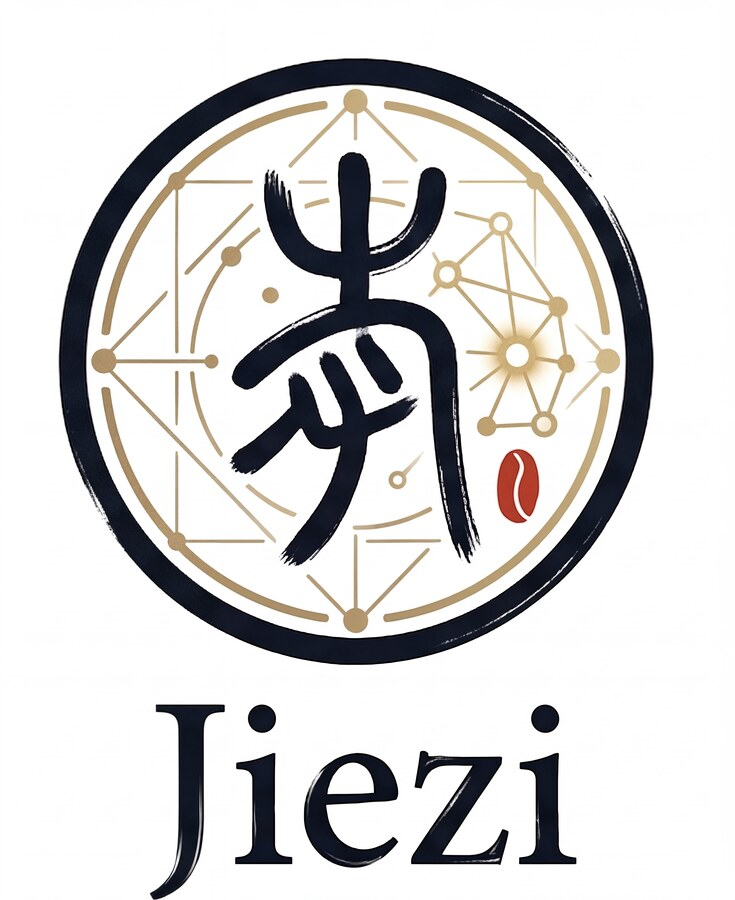

# 🧩 JieZi: A Large-Scale Expert-Audited Dataset and Benchmark for Ancient Chinese Character Exegesis

<p align="center">
  
</p>

<p align="center">
  <a href="https://ran00w.github.io/JieZi-test/">
    
  </a>
  <a href="https://github.com/Ran00w/JieZi-test">
    
  </a>
  <a href="https://huggingface.co/datasets/Ran0/JieZi">
    
  </a>
</p>

## 📌 News

| Date | Update |
| --- | --- |
| 2026-03-30 | JieZi repository is released. |
| 2026-04-09 | Supplementary material is released. |
| 2026-05-24 | JieZi-Dataset is released. |

## 📖 Introduction

JieZi is a large-scale expert-audited dataset and benchmark for Ancient Chinese Character Exegesis (ACCE), a vision-language task that models how scholars analyze ancient Chinese characters. Instead of limiting evaluation to character recognition, ACCE covers four progressive levels: basic character identification, glyph-form analysis, meaning exegesis, and diachronic evolution analysis.

The project provides JieZi-Dataset, a source-grounded VQA training dataset with over 500K QA pairs and 130K glyph images, and JieZi-Bench, an expert-curated benchmark of approximately 8K QA pairs. Together, they support training and evaluating multimodal large language models on scholar-aligned ancient character understanding, from identifying scripts and components to reasoning about original meanings and historical evolution.

## 🧠 Task Definition

Ancient Chinese Character Exegesis (ACCE) is organized into four progressive levels. Replace the placeholders below with representative glyph images and QA examples.

| Level | Focus | Image | Example QA |
| --- | --- | --- | --- |
| L1: Basic Character Identification | Identify the character and script type. | `path/to/l1_example.png` | **Q:** Fill in a Level-1 question here.<br>**A:** Fill in the answer here. |
| L2: Glyph-Form Analysis | Analyze structures, components, component functions, and formation principles. | `path/to/l2_example.png` | **Q:** Fill in a Level-2 question here.<br>**A:** Fill in the answer here. |
| L3: Meaning Exegesis | Explain the original meaning and semantic motivation of the glyph. | `path/to/l3_example.png` | **Q:** Fill in a Level-3 question here.<br>**A:** Fill in the answer here. |
| L4: Diachronic Evolution Analysis | Compare historical forms and explain how the character evolved across script stages. | `path/to/l4_example.png` | **Q:** Fill in a Level-4 question here.<br>**A:** Fill in the answer here. |

## 🚨 Reviewer Quick Access: Supplementary Material

> **For ACM MM reviewers:** please check the supplementary file first.

<p align="center">
  <a href="https://github.com/Ran00w/JieZi/raw/refs/heads/main/docs/supplementary_material.pdf">
    
  </a>
</p>

| Item | Access |
| --- | --- |
| 📄 Supplementary Material (PDF) | [**Click to Download**](https://github.com/Ran00w/JieZi/raw/refs/heads/main/docs/supplementary_material.pdf) |
| 📌 Repo Path | `docs/supplementary_material.pdf` |

---


<p align="center">
  
</p>

## ⚠️ Important Note

The original data of the dataset is sourced from public channels such as the dictionary, and its copyright shall remain with the original providers.
The collated and annotated dataset presented in this case is for **non-commercial** use only and is currently licensed to universities and research institutions.

## 🔥 Download

- This repo currently hosts supplementary material and part of data.
- Full dataset/code/model release links are available below.

| Platform | Link |
| --- | --- |
| 🤗 Hugging Face | [🔗 JieZi](https://huggingface.co/datasets/Ran0/JieZi) |
| 🌟 ModelScope | [🔗 JieZi](https://www.modelscope.cn/datasets/Ran0501/JieZi) |


## 🚀 Usage

### Install

```bash
pip install -r JieZi-bench/requirements-eval.txt
```

### Download benchmark data

Download `Jiezi-bench/` from [Hugging Face](https://huggingface.co/datasets/Ran0/JieZi) and place it at `JieZi-bench/Jiezi-bench/` (or update `data_root` in the run config).

### Configure model

Copy and edit a model config:

```bash
cp JieZi-bench/configs/models/gpt_5_4_api.example.yaml JieZi-bench/configs/models/my_model.yaml
```

For cloud APIs, set `base_url`, `api_key_env`, and `model`. For local vLLM models, edit `qwen3_5_4b_local.yaml` and set `model_path`.

### Run evaluation

```bash
python JieZi-bench/runners/run_eval.py \
  --run-config JieZi-bench/configs/runs/ancient_char_exegesis.yaml \
  --model-config JieZi-bench/configs/models/my_model.yaml
```

Smoke test (2 samples):

```bash
python JieZi-bench/runners/run_eval.py \
  --run-config JieZi-bench/configs/runs/ancient_char_exegesis.yaml \
  --model-config JieZi-bench/configs/models/my_model.yaml \
  --limit 2
```

Results are saved under `JieZi-bench/runs/ancient_char_exegesis/<timestamp>/`. See `metrics/summary.json` for aggregate scores.

## 📝 Citation

Coming soon.

## ☎️ Contact

If you have any questions, please contact us at [eeran0@mail.scut.edu.cn](mailto:eeran0@mail.scut.edu.cn).

Coming soon.

## 📝 Citation

Coming soon.

## ☎️ Contact

If you have any questions, please contact us at [eeran0@mail.scut.edu.cn](mailto:eeran0@mail.scut.edu.cn).

## 💙 Acknowledgement

- [SCUT-DLVCLab/MegaHan97K](https://github.com/SCUT-DLVCLab/MegaHan97K)
- [Pengjie-W/Puzzle-Pieces-Picker](https://github.com/Pengjie-W/Puzzle-Pieces-Picker)

## 🔐 Data Usage Agreement

Coming soon.

## 📜 License

This repository and the dataset are released under [CC BY-NC-ND 4.0](https://creativecommons.org/licenses/by-nc-nd/4.0/deed.zh-hans) for **non-commercial research purposes** only. By downloading or using the data, you agree to comply with the terms of this license.

## ©️ Copyright

- This repository can only be used for non-commercial research purposes.
- For commercial use, please contact Prof. Lianwen Jin (eelwjin@scut.edu.cn).
- Copyright 2026, Deep Learning and Vision Computing Lab (DLVC-Lab), South China University of Technology.
